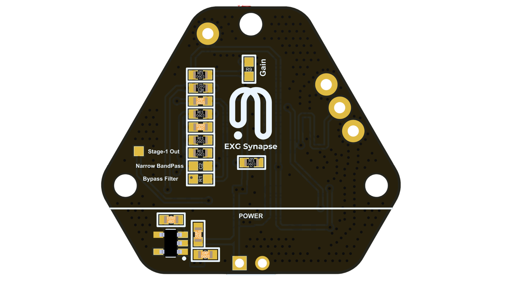

# ECG

1. W**hat is ECG?**
ECG stands for Electrocardiogram. It is a medical test that measures and records the electrical activity of the heart. The ECG helps in diagnosing various heart conditions and evaluating the heart's overall health.

1. **What is EXG Synapse?**
Neuphony EXG Synapse is an innovative, hexagon-shaped chip designed for recording high-quality biopotential signals from various regions of the body, including the heart (ECG), brain (EEG), eyes (EOG), and muscles (EMG). Serving as a robust analog-front-end (AFE) biopotential signal-acquisition board, the Neuphony EXG Synapse can seamlessly integrate with a range of microcontroller units (MCUs) or single-board computers (SBCs) equipped with an analog-to-digital converter (ADC). Compatible platforms include popular options such as Arduino UNO & Nano, Espressif ESP32 and more.

2. **Hardware Requirements** : EXG Synapse, DOIT-ESP32-DEVKIT-V1, Jumper Wires
**Software Requirements** : Arduino IDE

3. **PCB Configuration:**
EXG Synapse has configuration options in terms of gain and bandpass filter bandwidth. The user can modify these values depending on the use case. Here is an image showing the resistor pad R9(for gain) and capacitor pad C2(for filter bandwidth).

1. **Connection with ESP32**
EXG Synapse requires only three wires to connect to any MCU. 3V3 connects to the 3V3 pin on the ESP32 and GND to GND pin on the ESP32. The Output of EXG Synapse can be connected to any ADC pin of ESP32 and configured as an analog input to read the data.

1. **Flashing Code on ESP32**
To flash the required code on ESP32, you need to install Arduino IDE and setup for flashing to an ESP32. You can follow [this guide](https://espressif-docs.readthedocs-hosted.com/projects/arduino-esp32/en/latest/installing.html) if you don’t find your board listed in Arduino. Once your board is added to Arduino, you can go to [this GitHub repository](https://github.com/Neuphony/EXG-Synapse), here you will find all the necessary files for acquiring the data using EXG Synapse.
Navigate to the EEG folder and then to Arduino, and download required .ino file. Now compile and upload the code on your board.

2. **Skin Preparation**
Before placing the electrode, skin surface must be cleaned with an alcohol based wet wipe and then Nuprep Gel can be used to enhance the signal quality as it reduces the skin impedance. You can follow [this](https://www.youtube.com/watch?v=qQSClWIYUwM) guide on how to use Nuprep Gel while preparing for data acquisition.

3. **Electrode Placement:**
Check above image for correct electrode placement

1. **Data Visualization:**
Serial : The Lab Streaming Layer (LSL) is a system designed for real-time data streaming and recording. We have provided a python script located in the [GitHub repository](https://github.com/Neuphony/EXG-Synapse) used to read the data from serial and create a LSL stream. The stream created by the script can be easily visualized using a LSL-compatible software such as **[BrainVision LSL Viewer](https://pressrelease.brainproducts.com/lsl-viewer/).** It can be downloaded for free using this [link](https://www.brainproducts.com/downloads/more-software/#utilities).

    
    
    
    BLE : If flashed with the code provided under software\Arduino\ble, ESP32 will stream data continously over BLE. You can create a client side interface to read this data and use it for further applications.